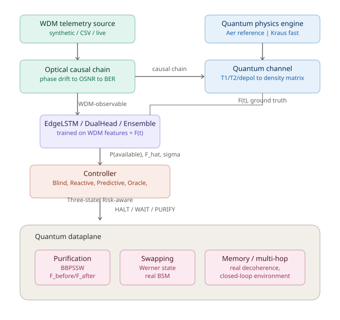

# Quantum Repeater Digital Twin

[](LICENSE)

A research-grade digital twin of a quantum repeater node, driven by
**WDM-observable classical telemetry** to predict quantum-state fidelity
and make low-latency, per-round admission-control decisions — combining
causal physics simulation (Qiskit Aer), predictive machine learning
(PyTorch), and calibrated decision theory into a single, closed-loop,
extensively tested platform.

**443 tests passing.** Full development history (70 chronological
addenda — every bug found, every negative result, every honest
limitation) lives in [`docs/history.md`](docs/history.md).

---

## 1. Problem

Quantum repeaters purify and swap entangled pairs to extend quantum
networks beyond direct transmission range. Every purification attempt
consumes real QPU resources; every swap only helps if the underlying
pairs are good enough. A repeater that always attempts (**Blind**)
wastes resources on doomed pairs. A repeater that only reacts to a
pair's *already-measured* fidelity (**Reactive**) can't anticipate
degradation before it happens. Can classical, WDM-observable optical
telemetry — signals a repeater can read *without* touching the quantum
state itself — predict future fidelity well enough to make **better**
admission-control decisions than either extreme?

## 2. Scientific hypothesis

```
WDM telemetry (t)  ->  optical degradation  ->  quantum degradation  ->  F(t + Delta t)
```

If phase drift, optical power, OSNR, BER, loss, and latency — all
classically observable without measuring the quantum state — are
causally upstream of the same physical processes (T1/T2 decoherence,
depolarization) that determine a stored pair's fidelity, then a
classical predictor watching only WDM telemetry should carry real
information about a pair's future quality, enough to justify skipping
doomed purification attempts *before* they're attempted. The central
hypothesis under test is not simply `MAE_ML < MAE_baseline`, but the
full causal chain: **does WDM telemetry contain sufficient predictive
information to produce better quantum-resource-allocation decisions**,
measured end to end (fidelity, yield, QPU cost, energy — see Results).

This was tested rigorously, not assumed: mutual information, Granger
causality, transfer entropy, temporal ablation, and real do()-calculus
interventions (Sections 4 and 12) all point the same direction, while
being honest about where they disagree.

## 3. Physical model

The causal chain is implemented as real, executable physics, not a
black-box approximation — see [`docs/physics.md`](docs/physics.md) for
the full equations and every approximation's stated validity range.

- **`ReferenceEngine`** (Qiskit Aer density-matrix simulation) vs.
  **`AnalyticalEngine`** (closed-form Kraus algebra; renamed from
  `FastEngine` — a name should describe what a method *is*, not an
  untested speed claim — `FastEngine` kept as a backward-compatible
  alias) — validated to agree to floating-point precision on every
  regime tested. Speed is **regime-dependent, not assumed**:
  `AnalyticalEngine` shows *no* measured advantage when an engine object
  is reused across calls (matching how this project's dataset generator
  actually uses it), but a genuine ~6x speedup when a fresh engine must
  be constructed per call — traced directly to Aer's ~26ms
  circuit-construction overhead, not the simulation itself.
- **Purification** (BBPSSW): closed-form analytical formula, cross
  -validated against a real density-matrix simulation (agreement to
  <1e-8 across the full useful range), connected to real telemetry
  -derived F_before values (mean gain +0.032 fidelity on 1625 real
  admitted pairs).
- **Swapping** (Werner-state / real BSM density-matrix simulation) —
  validated against the analytical formula `F1*F2 + (1-F1)(1-F2)/3`.
- **WAIT is a real physical action** — genuine multi-tick decoherence
  (`begin_wait_hold()` / `wait_tick_and_reobserve()`), verified
  monotonically decreasing fidelity from a valid starting pair (a real
  pitfall — starting from an *unavailable* round's F=0 showed fidelity
  rising toward the maximally-mixed equilibrium instead — is guarded
  against explicitly).
- **Real do()-calculus interventions** (not mere conditioning) reveal a
  sharp, non-obvious sensitivity structure: at this project's baseline
  high-OSNR operating point, loss/OSNR/optical-power perturbations show
  **zero measurable effect** on fidelity even at 5-20dB magnitudes — the
  BER-vs-OSNR "waterfall" curve is deeply saturated there. Only a direct
  BER intervention, or phase_drift pushed near a π/2 interference
  singularity, shows real sensitivity. A formal LOCAL sensitivity ranking
  (S_X ≈ ΔF/ΔX) confirms this quantitatively: **BER is the only variable
  with non-zero local sensitivity** (S_X=-12.38) at the baseline — every
  other WDM variable's local sensitivity is exactly zero there. A genuine
  quantitative finding about this simulation's specific regime, not a
  general physical claim.

## 4. WDM telemetry

12 WDM-observable features (`WDM_FEATURE_COLUMNS`) are formally
separated from 3 quantum-privileged features (`T1`, `T2`,
`Depolarization_Level`) throughout — see
[`docs/telemetry.md`](docs/telemetry.md) for the full data contract, and
[`telemetry_interface.py`](telemetry_interface.py) for a formal
`read()`/`schema()`/`validate()` interface (Synthetic/CSV/Parquet/Live
sources, all interchangeable, with real leakage-safe normalization,
outlier detection, and irregular-sampling resampling).

- **Causal sensitivity ≠ predictive value — demonstrated concretely, not
  just stated as principle**: `BER` has by far the largest causal
  sensitivity to conditional fidelity (S_X=-12.38, do()-intervention
  evidence) yet is the LEAST useful WDM feature for actual prediction —
  removing it from DualHead's inputs *improves* MAE and R², because BER
  sits saturated near zero across nearly the entire natural data
  distribution and carries almost no discriminative variance to learn
  from. Conversely, `Loss_Db` is the single MOST predictively valuable
  WDM component, despite having zero measured conditional-fidelity
  sensitivity — it matters through the availability head, not the
  fidelity head. Three connected addenda (causal intervention,
  sensitivity ranking, feature ablation) triangulate this into a single,
  coherent, quantitative story that a single method alone would have missed.
- **Three independent causal-inference methods** (Granger causality,
  transfer entropy, temporal ablation) converge on WDM telemetry
  carrying genuine, structurally-exploited predictive information —
  while honestly disagreeing on specifics (e.g. `Latency` shows the
  strongest transfer-entropy signal but isn't Granger-significant at
  p<0.05; removing WDM features entirely collapses R-squared from +0.18
  to -3.66, the single cleanest piece of evidence). These are classified
  by evidence STRENGTH (`temporal_precedence` < `predictive_causality` <
  `information_transfer` < `physical_causal_hypothesis` <
  `experimental_causal_validation`, see `causal_intervention.py`'s
  `CausalEvidenceLevel`) — never treated as interchangeable proof of
  physical causation.
- **Mutual information MI(X_t, F(t+Δt)) decays smoothly with horizon,
  then shows a real, verified non-monotonic bump** — MI drops from
  100% (Δt=1) to 23.7% (Δt=10, matching the physical mean-reversion
  timescale), then genuinely RISES again through Δt=50 (28.7%) before
  declining further. Checked directly before reporting: not a
  sample-size artifact (effective N barely changes across these
  horizons) and not estimator noise (MI(50) > MI(10) held across 5
  independent estimator seeds, by a consistent margin every time). The
  underlying physical mechanism is stated as an open hypothesis, not
  resolved — a secondary, longer-timescale process is plausible but
  unconfirmed.
- **Source-agnosticism is proven, not just architecturally implied**: the
  same real EdgeLSTM model, given the same underlying data read via
  `SyntheticWDMSource`, `CSVTelemetrySource`, and `ParquetTelemetrySource`,
  produces byte-identical predictions regardless of which source
  supplied the DataFrame — verified directly (`torch.allclose`), not
  assumed from the shared interface's design. Real timestamp validation
  (monotonicity, duplicates) and sampling-rate validation (actual vs.
  expected period, within a stated 10% tolerance) were added to close a
  gap between the schema's declared capability and what `validate()`
  actually checked.

## 5. Digital Twin architecture



<details>
<summary>ASCII fallback (for terminals / plain-text viewers)</summary>

```
   WDM Telemetry Source          Quantum Physics Engine
  (synthetic / CSV / live)      (Aer reference | Kraus fast)
          |                              |
          v                              v
   +-------------+              +------------------+
   |  Optical     |--causal---->|  Quantum Channel   |
   |  Chain       |   chain     |  T1/T2/depol        |
   | (dphi_c->OSNR|             |  -> density matrix   |
   |  ->BER)      |             +---------+------------+
   +------+-------+                       |
          | WDM-observable                |
          | features                      | F(t) (ground truth,
          v                                | privileged)
   +-----------------+                     |
   |  EdgeLSTM /      |                    |
   |  DualHead /      |<-------(train)-----+
   |  Ensemble        |
   +--------+---------+
            | P(available), F_hat(t+dt), sigma
            v
   +-----------------------------+
   |  Controller                  |
   |  Blind|Reactive|Predictive|  |
   |  Oracle|Three-state|Risk-aware|
   +--------+---------------------+
            | HALT / WAIT / PURIFY
            v
   +-----------------------------------+
   |  Quantum Dataplane                 |
   |  Purification (BBPSSW)             |
   |  Swapping (Werner/BSM)             |
   |  Memory (real decoherence)         |
   |  Multi-hop closed loop             |
   +-------------------------------------+
```

</details>

`quantum_twin/` provides this architecture as an importable package
(`core`, `optical`, `quantum`, `ml`, `control`, `simulation`,
`evaluation`) — currently a compatibility layer re-exporting the
already-tested flat modules at the repository root, by deliberate
design (see `quantum_twin/__init__.py`'s docstring): migrating ~54
files' actual contents was judged higher-risk than benefit for this
project's current maturity, and the package boundary is the part that
matters for consumers. This wasn't left untested: a real migration of
one low-risk module was attempted and hit a genuine circular-import bug
(`quantum_twin/__init__.py` eagerly imports every subpackage, so
migrating any module reachable from a shim that imports back to that
same module cycles) — reverted cleanly, with the exact structural cause
and a concrete fix for future attempts documented in `docs/history.md`'s
sixty-third addendum.

## 6. ML models

- **EdgeLSTM** (point estimate), **EdgeGRU**, **EdgeTCN** — compared
  head-to-head on real inference latency (batch=1, CPU, forward-only
  timing): counter-intuitively, `EdgeGRU` has *fewer* parameters than
  `EdgeLSTM` but runs **~3.5x slower** — parameter count does not
  predict latency; only measurement does. The same holds for memory:
  `FlattenMLP` has by far the MOST parameters (11361, ~5x any other
  architecture) but the LEAST activation memory (128 bytes, ~10x
  smaller than the recurrent/convolutional models' 1280 bytes) — the
  recurrent architectures must hold hidden states across the full
  window (20 timesteps), while FlattenMLP's largest activation is a
  single hidden-layer vector, independent of window size.
- **DualHead** (`P(available|X) x E[F|available,X]`) — the single
  biggest architectural fix in this project. A single point-estimate
  head, trained on the blended target (mixing near-irreducible
  photon-loss zeros with genuinely learnable conditional fidelity),
  plateaus at a hard MAE ceiling *regardless of which features it
  receives* — confirmed independently in three different experiments
  (controller comparison, WDM-vs-privileged ablation, prediction-horizon
  study). Splitting availability from conditional fidelity breaks that
  ceiling every time it was tested.

## 7. Uncertainty

- **Probabilistic ensemble** (deep ensemble + bootstrap + temperature
  calibration) — raw ensemble disagreement is *not* calibrated
  uncertainty (1-sigma coverage measured at 4%, not the ~68% a correct
  Gaussian should give); temperature scaling fixes the calibration
  exactly, but reveals the point-estimate model's true uncertainty is
  too wide for confident per-pair decisions — an honest, load-bearing
  finding, not swept under the rug.
- **Uncertainty method comparison** (Deep Ensemble vs. MC Dropout vs.
  Quantile Regression vs. Conformal Prediction) — all four have similar
  MAE (0.254-0.303), but coverage reveals dramatic differences invisible
  to accuracy alone: Conformal Prediction achieves near-exact 90% target
  coverage (89.07%, matching its theoretical guarantee), Deep Ensemble
  is reasonably calibrated (85.80%), while MC Dropout catastrophically
  under-covers (0.38% — intervals far too narrow) and Quantile
  Regression substantially under-covers (59.67%) on this real dataset.
- **Conformal Prediction's classical coverage guarantee does not hold
  perfectly under this project's temporally-correlated data** —
  Standard Conformal's windowed coverage drifts across the test period
  (83.0%-88.7%, a 5.66pp range around the 90% target); Adaptive Conformal
  (online self-correcting quantile) shows a narrower, more accurate range
  (86.2%-89.9%). A real sign-error bug in the adaptive method's update
  rule was caught by dedicated regression tests before any result was
  trusted — the buggy version had reported an implausible 97% coverage.
  The drift traces to a specific, verified mechanism (not just abstract
  non-exchangeability): miscoverage concentrates on `F_t=0`
  (channel-unavailable) rounds, whose frequency genuinely varies across
  the test period (34%-45%) — tying back to the project's central
  single-head "blended target" theme.

## 8. Predictive control

Five controllers compared on equal footing throughout: **Blind**
(always attempt), **Reactive** (threshold on current F(t)),
**Predictive** (single-head EdgeLSTM), **Oracle** (upper bound),
**DualHead** (the strongest predictive controller found), plus a
**Three-state** (HALT/WAIT/PURIFY, calibrated-uncertainty-aware) and a
**Risk-aware** controller (`a* = argmin E[C_QPU + C_latency + C_energy +
C_fidelity + C_failure]`) built on real energy and purification-success
cost models.

- **The risk-aware controller's robustness is dramatically asymmetric**
  — extremely stable against perturbations pushing further toward
  purification (already saturated there under honestly-calibrated
  sigma, echoing the risk-aware controller's own documented always
  -PURIFY-collapse), but catastrophically unstable against perturbations
  pushing the other way: a negative bias or OOD shift of moderate
  magnitude collapses `decision_robustness` to exactly 0.0 and flips the
  controller to missing ~50% of genuinely good pairs. Even tiny
  prediction noise produces a 51% missed-opportunity rate under raw
  (uncalibrated) sigma — the controller sits at a fragile decision
  boundary, not a robust one.
- **Only 2 of the risk-aware controller's 5 named cost weights actually
  matter** (10-seed sweep, 0.1x-10x range): `C_QPU` and `C_fidelity` act
  as opposing sharp thresholds that can flip the controller entirely
  between PURIFY and WAIT; `C_latency`, `C_energy`, and `C_failure` show
  essentially zero effect across the full range tested — their absolute
  magnitudes are too small relative to the QPU/fidelity terms to matter
  in this cost model.
- **Energy is decomposed into six genuinely separate line items** —
  `E_QPU`, `E_inference`, `E_memory`, `E_communication`, `E_optical`,
  and `E_control` (the admission-decision logic itself, distinct from
  the model's forward pass, added to connect the real measured
  decision-stage latency of 3.863μs from the E2E latency benchmark —
  see [`docs/benchmarks.md`](docs/benchmarks.md)) — never collapsed
  into one number, so a reader can see exactly which cost dominates in
  a given regime.
- **No single number crowns a "best" controller** — a formal multi
  -metric scorecard (fidelity/yield, QPU cost, false purification,
  missed opportunity, latency, energy, all reported separately) shows
  genuine trade-offs: DualHead has the best yield among real controllers
  (45.09%) but also the highest error counts and energy/latency among
  them; Reactive purifies far less than Blind at similar yield, at the
  cost of real missed opportunities. `Predictive`'s row came out
  numerically *identical* to `Blind`'s in this run — an independent
  reconfirmation, via an entirely different code path, of this project's
  long-documented single-head-model collapse failure mode.
- **Energy accounting is honest, not force-fit**: under this project's
  documented default estimates, predictive control's classical
  inference cost is *not quite* energy-justified even at DualHead's
  real ~68-85% halt rate — though the gap narrows from 250x to 6-8x as
  halt rate increases, a genuine, monotonic, sensitivity-analyzed
  relationship, not a single cherry-picked number.

## 9. Multi-hop

- **Closed-loop environment** — a genuinely incremental, stateful
  simulator (`reset()` / `observe()` / `step(action)`), not dataset
  replay; extended to a real `ClosedLoopMultiHopEnvironment` for N-hop
  networks. Naive sequential swapping collapses to 0% success beyond 1
  hop (Werner-state fidelity degrades geometrically) — the same finding
  this project's gated, retry-capable multi-hop chain (`causal_chain.py`)
  was built to fix, now demonstrated concretely from a different angle.
  The closed-loop multi-hop environment's 0% multi-hop success rate is a
  property of its simple sequential-swap design (no retry/gating), not a
  claim that multi-hop repeaters are infeasible.
- **Extended to 1-5 hops with false-purification/missed-opportunity
  tracking**: a non-predictive "reactive risk-aware" variant (current
  F_t as mu, fixed sigma — no trained forecaster in this raw-physics
  environment) behaves nearly identically to Blind (215 vs. 219 total
  false purifications across all 5 hop counts) — the same `p_good`
  -saturation dynamic documented for the single-link risk-aware
  controller reproducing itself here, a genuine limitation of this
  specific non-predictive adapter, not evidence risk-aware control
  never helps. Reactive is structurally false-purification-proof by
  construction (0 across every hop count, verified on a real
  environment run, not just argued from its rule) — its threshold rule
  makes purifying an already-bad pair impossible by definition.

## 10. Experimental methodology

- **Enforced train/validation/calibration/test protocol**
  (`model_selection_protocol.py`) — "don't tune on the test set" is a
  runtime-ENFORCED rule, not just a documented convention:
  `get_test_data()` raises `ProtocolViolationError` if called before
  `freeze()`. Demonstrated end to end: an admission threshold selected
  on VALIDATION only (MAE=0.01730), frozen, then evaluated on TEST
  exactly once (MAE=0.01615) — close but not suspiciously identical,
  the healthy signature of no leakage.
- **Automated temporal leakage audit** (`temporal_leakage_audit.py`) —
  checks for future leakage, overlapping-target leakage, normalization
  leakage, and split leakage, applied to the REAL production pipeline.
  Several tests deliberately introduce a broken/leaky variant to verify
  the checks have genuine detection power, not just always passing. A
  real false positive was found and fixed during development: an
  `F_t=0.0` value collision at the split boundary, expected given
  `F_t=0.0`'s ~36% base rate in this dataset, not an actual bug.
- **Domain shift / OOD generalization is tested, not assumed** — this
  project has **not established clean physical generalization**.
  Zero-shot domain-shift testing (train in-distribution, evaluate
  out-of-distribution with no retraining) shows the model's behavior
  under distribution shift is complex and regime-specific: excluding
  privileged T1/T2 features makes generalization WORSE on T1/T2-shifted
  regimes (Delta MAE 0.231 vs. 0.180 with T1/T2 included) but BETTER on
  a distance-shifted regime (Delta MAE 0.042 vs. 0.138). A methodological
  confound (MinMaxScaler producing out-of-range inputs under T1/T2 shift)
  was found and explicitly disentangled before drawing any conclusion.

## 11. Statistical validation

- **DualHead beats every other controller, with statistical rigor now
  matching a 10-seed campaign**: mean yield 50.47% (95% CI [46.50,
  54.45]) vs. Blind's 42.65%, Reactive's 43.06%, and single-head
  Predictive's 43.02%. DualHead wins in **10 out of 10 seeds** against
  every other real controller — both paired t-test and Wilcoxon
  signed-rank test agree (all p < 0.001), every 95% CI for the mean
  difference excludes zero, and Cohen's d exceeds 1.7 (conventionally
  "huge") for all three pairwise comparisons.
- **WDM-only telemetry significantly outperforms privileged-only
  (T1+T2) access** for conditional fidelity prediction: paired t-test
  across 10 independent seeds, **p=0.0083**, Cohen's d=1.07 (large
  effect) — and is formally **statistically EQUIVALENT** to full-oracle
  access (TOST equivalence test, p=0.0017 < 0.05, within a pre-specified
  ±0.005 MAE margin — a genuine equivalence claim, not merely the
  absence of significance in the standard two-sided test, which alone
  gave only "indistinguishable," p=0.59). Combining WDM+privileged beats
  either alone, suggesting the two carry complementary, not redundant, information.

## 12. Results

The findings above (Sections 3-11) ARE this project's results — this
section exists to state, in one place, what kind of claim each is.
Every headline finding traces to a specific script and a specific run
(see [`docs/history.md`](docs/history.md) for the full, unabridged
account); [`outputs/master_report/`](outputs/master_report) (built by
`run_master_report.py`) consolidates the underlying CSVs, figures, and a
full reproducibility manifest into one place, so the main conclusions
can be reconstructed without re-running dozens of scripts by hand.

## 13. Limitations (stated explicitly, not hidden)

- **This project has not established clean physical generalization** —
  see Section 10.
- Most headline comparisons use 1 seed by default; the WDM-vs-privileged
  and DualHead-vs-others findings above are the exceptions, validated
  across 10 seeds specifically because they were flagged as needing it.
- Every energy and risk-cost constant is an explicitly-labeled
  order-of-magnitude *estimate*, not a hardware measurement — see
  `energy_model.py` and `risk_aware_controller.py`'s own docstrings for
  the full disclosure, including the significant omission of cryogenic
  cooling overhead for superconducting-style QPU cost estimates.
- `quantum_twin/` remains a re-export layer, not a physical code
  migration (see Section 5).
- See [`docs/limitations.md`](docs/limitations.md) and
  [`docs/validation_levels.md`](docs/validation_levels.md) for the
  complete list, including this project's own formal audit of its
  documentation for unqualified claims (`real-time`, `hardware-ready`,
  etc.) — one real violation was found and fixed in this very README.

## 14. Reproducibility

- **`reproducibility.py`**: full experiment manifests
  (`config.yaml`, `environment.json`, `git_commit.txt`,
  `dataset_hash.txt` with a real verifiable SHA-256, `random_seeds.json`,
  `hardware.json`, `requirements.lock`, `command.txt`, `stdout.log`,
  `plots/`, `tables/`).
- **`tests/test_physics_regression.py`**: golden-value regression tests
  (exact numeric snapshots, explicit absolute/relative tolerances) for
  channel, memory, purification, swapping, and multi-hop physics —
  designed to catch silent drift from future refactoring.
- **CI**: `.github/workflows/ci.yml` — lint -> typecheck -> unit tests ->
  {physics regression, integration tests, statistical tests in parallel}
  -> small benchmark. Run locally: `pytest -m unit`, `pytest -m physics`,
  `pytest -m integration`, `pytest -m statistical`, `pytest -m benchmark`,
  `pytest -m slow`, `pytest -m experimental`.

```bash
pip install -r requirements.txt
pytest                    # full suite, 443 tests
pytest -m unit -q         # fast subset only
python run_closed_loop_demo.py --config config.yaml
python run_master_report.py --config config.yaml   # consolidates outputs/*.csv into outputs/master_report/
```

## 15. Future experimental validation

Every result in this project sits at **L1-stochastic** realism,
validated only by simulation, analytical formula, Qiskit Aer, or
synthetic telemetry — see [`docs/validation_levels.md`](docs/validation_levels.md)
for the full `RealismLevel`/`ValidationLevel` taxonomy
(`validation_taxonomy.py`). Reaching L2 (richer physical models),
L3 (hardware-in-the-loop, a real optical/quantum component feeding live
data into the simulation), or L4 (a genuine physical quantum-repeater
experiment) is explicitly **not attempted** in this project. The
telemetry interface (Section 4) is deliberately model-agnostic
(`SyntheticWDMSource`, `CSVTelemetrySource`, `ParquetTelemetrySource`,
`LiveWDMSource` all share one contract) specifically so a future
real-hardware integration would not require changing any downstream
model or controller code — but no such integration exists yet, and
none of this project's findings should be read as validated beyond
L1-stochastic simulation until one does.

## License

Apache License 2.0 — see [`LICENSE`](LICENSE).

## Topics

`quantum-computing` `quantum-networks` `quantum-repeater` `digital-twin`
`edge-ai` `machine-learning` `qiskit` `quantum-memory` `wdm`
`predictive-control` `uncertainty-quantification` `causal-inference`

---

**For the complete, unabridged development history** — every one of the
70 addenda, every bug found and fixed with its full investigation, every
honestly-reported negative result — see [`docs/history.md`](docs/history.md).
